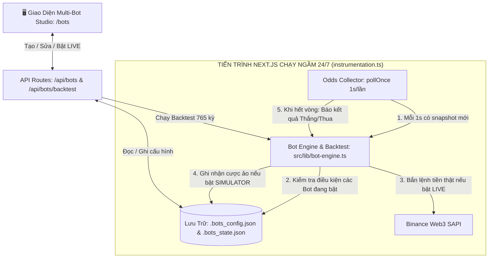

# Implementation Plan: Nền Tảng Multi-Bot Studio & Backtest Thống Kê (Native Next.js Architecture)

## 1. Overview & Mục Tiêu Hệ Thống
Xây dựng một nền tảng **Multi-Bot Studio** toàn diện trên Next.js 16 cho phép người dùng:
1. **Khởi tạo & Cấu hình Đa Bot (Multi-Bot Configuration)**:
   - Đặt tên Bot, chọn chiến lược (Gấp thếp Favorite 85-90%, Săn lật kèo Underdog, EV+ Sniper).
   - Quản lý vốn: Số tiền cược ban đầu (`baseStake`), Hệ số gấp thếp (`multiplier`), Số lần gấp tối đa (`maxSteps`, mặc định 2 bước), Giới hạn lỗ tối đa trong ngày (`maxDailyLoss`).
   - Chọn phiên giao dịch được phép chạy: Tất cả, Á, Âu, Mỹ, Đêm.
   - Các bộ lọc rủi ro: Bỏ phút đầu `5-4m` (chống vào quá sớm), Bỏ 35s cuối (chống giật sát nút $< \$15$), Đệm giá an toàn ($\Delta P \ge \$20$).
   - Cooldown sau khi thua: Nghỉ 2 vòng tiếp theo (tỉ lệ thắng trận thứ 3 tăng vọt lên 91.6%).
2. **Thẩm Định Hiệu Quả Tức Thời Qua Thống Kê (Instant Backtest Engine)**:
   - Ngay trên form tạo/chỉnh sửa bot, hệ thống tự động chạy simulation đối chiếu với toàn bộ **765 kỳ logs thực tế** trong `< 50ms`.
   - Hiển thị ngay: Tỷ lệ thắng (Win Rate), Lãi/Lỗ ròng (Net PnL), Sụt giảm tối đa (Max Drawdown), Số lần chạm ngưỡng cắt lỗ, và Huy hiệu xếp hạng an toàn.
3. **Vận Hành Tự Động 24/7 Trong Tiến Trình Next.js (Native Background Loop)**:
   - Tận dụng `src/instrumentation.ts` và vòng lặp 1s có sẵn của `src/lib/odds-collector.ts` để thực thi bot ngầm liên tục 24/7 (hoạt động 100% tự động trên cả local lẫn khi deploy Railway qua `npm run start`).
   - Hỗ trợ công tắc 3 chế độ trên mỗi bot: **TẮT (OFF)** | **SIMULATOR (Đánh ảo xem PnL sống)** | **LIVE REAL TRADE (Bắn lệnh tiền thật qua Binance Web3 SAPI)**.

---

## 2. Kiến Trúc Kỹ Thuật (Streamlined Next.js Architecture)



---

## 3. Đặc Tả Dữ Liệu Cấu Hình Bot (Bot Schema)

```typescript
export interface BotConfig {
  id: string;                      // ID duy nhất (uuid)
  name: string;                    // Tên bot (ví dụ: "Bot 85-90% Gấp Thếp Phiên Mỹ")
  enabled: boolean;                // Bật / Tắt bot
  mode: 'SIMULATOR' | 'REAL_TRADE';// Chế độ đánh ảo hay tiền thật
  strategy: 'MARTINGALE_FAVORITE' | 'UNDERDOG_HUNTER' | 'EV_SNIPER';
  
  // Quản lý vốn
  baseStake: number;               // Số tiền cược ban đầu (ví dụ: 10 USDT)
  multiplier: number;              // Hệ số gấp thếp (ví dụ: 4.0x)
  maxSteps: number;                // Số bước gấp thếp tối đa (ví dụ: 2 bước)
  maxDailyLoss: number;            // Giới hạn lỗ tối đa trong ngày (ví dụ: 50 USDT)

  // Điều kiện vào lệnh
  oddsMin: number;                 // Odds tối thiểu (ví dụ: 0.85)
  oddsMax: number;                 // Odds tối đa (ví dụ: 0.90)
  sessions: TradingSession[];      // ['asia', 'europe', 'us', 'night'] hoặc ['all']

  // Bộ lọc tránh thua lỗ
  cooldownRounds: number;          // Số vòng nghỉ sau khi thua (mặc định: 2)
  minTimeRemaining: number;        // Chặn giây cuối (mặc định: 35s)
  maxTimeRemaining: number;        // Chặn vào quá sớm (mặc định: 240s)
  minPriceBuffer: number;          // Đệm giá an toàn tối thiểu (mặc định: $20)

  createdAt: number;
  updatedAt: number;
}

export interface BotRuntimeState {
  botId: string;
  currentStake: number;
  currentStep: number;
  cooldownRemaining: number;
  dailyLoss: number;
  dailyPnl: number;
  totalTrades: number;
  winCount: number;
  lossCount: number;
  lastTradeTimestamp: number;
  lastActiveMarketId: number | null;
  status: 'IDLE' | 'IN_TRADE' | 'COOLDOWN' | 'STOPPED_MAX_LOSS';
}

export interface BacktestResult {
  totalRoundsEvaluated: number;
  tradesCount: number;
  wins: number;
  losses: number;
  winRate: number;
  netPnl: number;
  maxDrawdown: number;
  cutLossCount: number;
  rating: 'EXCELLENT' | 'BALANCED' | 'HIGH_RISK';
}
```

---

## 4. Giao Diện Người Dùng (UI/UX)
1. **Trang `/bots`**:
   - Header thống kê: Tổng số bot, Số bot đang chạy LIVE, Tổng PnL thực tế hôm nay.
   - Nút `+ Tạo Bot Mới`.
2. **Modal Form Tạo / Sửa Bot**:
   - Tab 1: Cấu hình cơ bản (Tên, Chiến lược, Số tiền, Gấp thếp, Phiên, Max Loss).
   - Tab 2: Bộ lọc an toàn (Chống sát nút 35s, Chống vào sớm 240s, Đệm giá $20, Cooldown 2 trận).
   - **Bảng xem trước Backtest (Live Preview Card)**: Tự động cập nhật Winrate, Net PnL, Max Drawdown trên 765 kỳ mỗi khi người dùng thay đổi bất kỳ ô input nào.
3. **Lưới Thẻ Bot (Bot Cards Grid)**:
   - Mỗi card hiển thị: Tên, Badge chiến lược, Trạng thái (Idle / In Trade / Cooldown / Chạm Max Loss), Vốn cược hiện tại, Winrate, PnL.
   - Công tắc chuyển chế độ: **OFF** | **SIMULATOR** | **LIVE REAL TRADE** (kèm modal xác nhận rủi ro).
   - Nút Xóa bot, Nút Chỉnh sửa, Nút xem lịch sử các lệnh bot đã cược.

---

## 5. Lộ Trình Phân Rã Triển Khai (Phased Roadmap)

### Phase 1: Core Engine & Backtest Thống Kê
- Xây dựng `src/lib/bot-engine.ts` quản lý máy trạng thái đa bot, đánh giá tín hiệu và chạy backtest siêu tốc trên 765 kỳ logs.
- Xây dựng API `/api/bots` và `/api/bots/backtest` hỗ trợ lưu cấu hình và thẩm định tức thì.

### Phase 2: Tích Hợp Vòng Lặp Ngầm 24/7 & Live Trade
- Gắn hàm điều phối `tickMultiBots()` và `resolveMultiBots()` trực tiếp vào `src/lib/odds-collector.ts`.
- Đảm bảo bot tự động chạy ngầm liên tục khi Next.js khởi động (cả local lẫn Railway).
- Kết nối logic bắn lệnh thật `executeLiveTrade` khi bot bật cờ LIVE.

### Phase 3: Giao Diện Multi-Bot Studio Hoàn Chỉnh
- Xây dựng trang `src/app/bots/page.tsx` với đầy đủ modal form cấu hình, live backtest preview, và các thẻ bot.
- Tích hợp liên kết điều hướng trực tiếp trên thanh Header chính.
